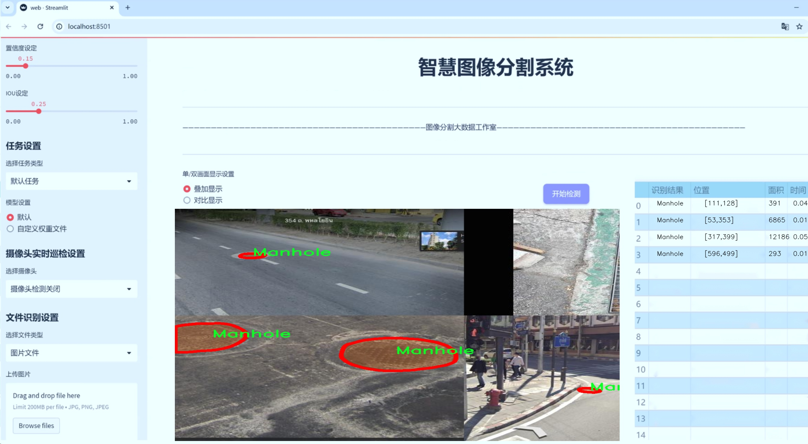
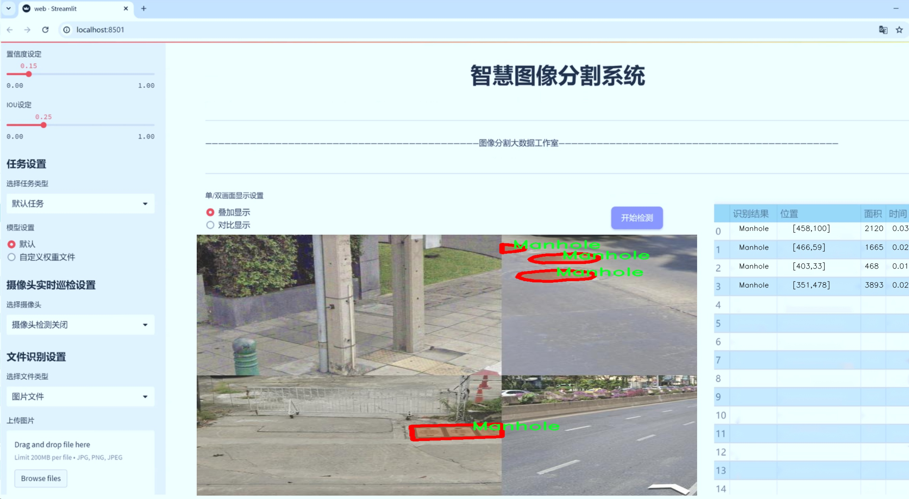
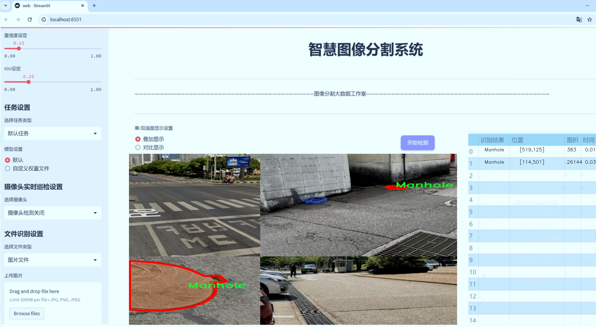
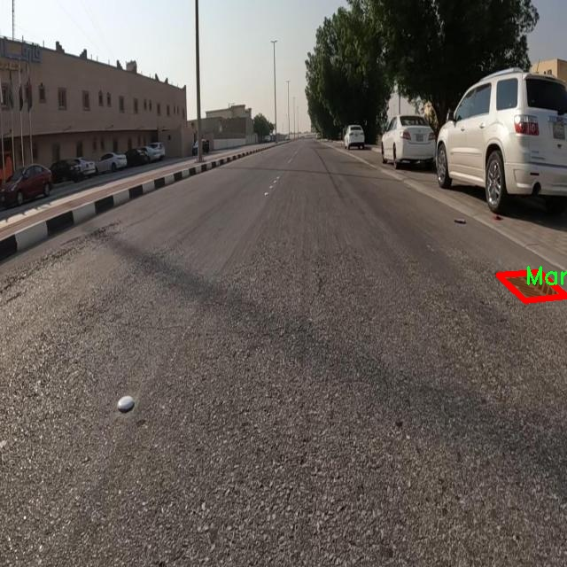
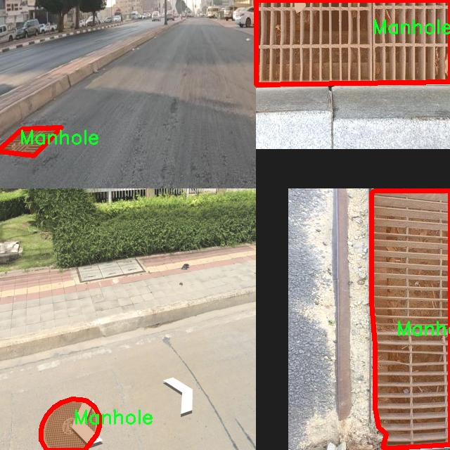
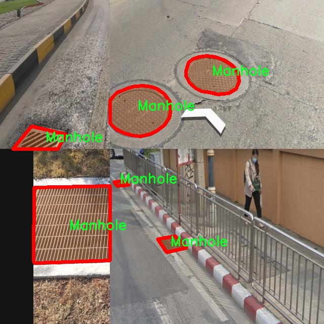
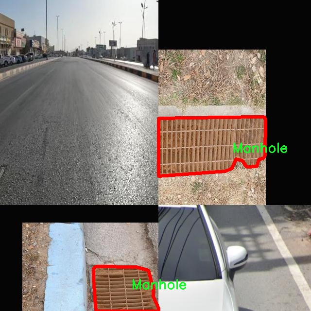
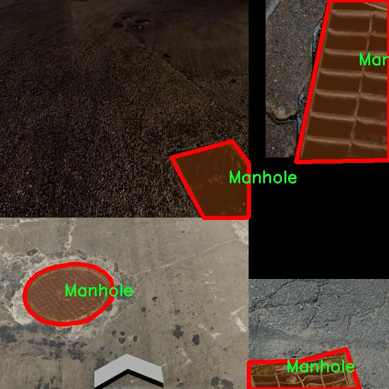

# 城市基础设施缺陷分割系统： yolov8-seg-C2f-ODConv

### 1.研究背景与意义

[参考博客](https://gitee.com/YOLOv8_YOLOv11_Segmentation_Studio/projects)

[博客来源](https://kdocs.cn/l/cszuIiCKVNis)

研究背景与意义

随着城市化进程的加快，城市基础设施的维护与管理愈发显得重要。城市基础设施不仅包括道路、桥梁、隧道等交通设施，还涵盖了人hole、坑洞、减速带等重要的城市元素。这些基础设施的健康状况直接影响到城市居民的生活质量与安全。然而，传统的基础设施检查方法往往依赖人工巡检，效率低下且容易出现遗漏。近年来，计算机视觉技术的快速发展为城市基础设施的缺陷检测提供了新的解决方案，尤其是基于深度学习的目标检测与分割技术，能够在保证高精度的同时，大幅提升检测效率。

在众多目标检测与分割算法中，YOLO（You Only Look Once）系列算法因其实时性和高效性而受到广泛关注。YOLOv8作为该系列的最新版本，结合了更为先进的网络结构与训练策略，展现出优越的性能。然而，针对城市基础设施缺陷的具体应用场景，YOLOv8仍存在一定的局限性，例如在复杂背景下的分割精度和对小目标的检测能力。因此，基于YOLOv8的改进，构建一个专门针对城市基础设施缺陷的分割系统，具有重要的研究价值与实际意义。

本研究所采用的数据集“Manhole3”包含1300幅图像，涵盖了人hole、坑洞和减速带三类目标。这一数据集的构建为我们提供了丰富的样本，使得模型能够在多样化的城市环境中进行训练与测试。通过对这些基础设施缺陷的精确分割，能够为城市管理者提供实时的基础设施健康状况评估，进而优化维护资源的配置，提高城市基础设施的运行效率与安全性。

此外，随着智能城市理念的兴起，城市基础设施的智能化管理成为未来发展的重要方向。基于改进YOLOv8的城市基础设施缺陷分割系统，不仅能够实现对基础设施缺陷的自动检测与分割，还可以为后续的智能决策提供数据支持。通过将检测结果与城市管理系统相结合，能够实现对基础设施的动态监测与预警，提升城市管理的智能化水平。

综上所述，基于改进YOLOv8的城市基础设施缺陷分割系统的研究，不仅能够填补现有技术在城市基础设施检测领域的空白，还将为智能城市建设提供重要的技术支撑。通过高效、准确的缺陷检测与分割，能够有效提升城市基础设施的管理水平，保障城市居民的生活安全与质量，为实现可持续城市发展目标贡献力量。

### 2.图片演示







注意：本项目提供完整的训练源码数据集和训练教程,由于此博客编辑较早,暂不提供权重文件（best.pt）,需要按照6.训练教程进行训练后实现上图效果。

### 3.视频演示

[3.1 视频演示](https://www.bilibili.com/video/BV17ozzY1Ekt/)

### 4.数据集信息

##### 4.1 数据集类别数＆类别名

nc: 3
names: ['Manhole', 'Pothole', 'Speed bump']


##### 4.2 数据集信息简介

数据集信息展示

在现代城市管理中，基础设施的维护与管理显得尤为重要。随着城市化进程的加快，城市基础设施面临着越来越多的挑战，尤其是道路和交通设施的损坏问题。为了有效地识别和分类这些基础设施缺陷，开发了一种基于改进YOLOv8-seg的城市基础设施缺陷分割系统。本系统的训练数据集“Manhole3”在这一研究中发挥了至关重要的作用。

“Manhole3”数据集专注于城市基础设施的三种主要缺陷类型，具体包括：井盖（Manhole）、坑洞（Pothole）和减速带（Speed bump）。这些类别不仅反映了城市道路的常见问题，也为研究人员提供了一个全面的基础，以便于在不同场景下进行缺陷检测和分类。数据集中包含的类别数量为三，分别对应于城市交通管理中最为常见的基础设施问题。

井盖（Manhole）是城市排水系统的重要组成部分，其位置和状态直接影响到城市的排水能力和行车安全。井盖的损坏或缺失不仅会造成交通事故，还可能导致城市内涝等严重后果。因此，准确识别井盖的状态对于城市管理者来说至关重要。数据集中包含的井盖图像，涵盖了不同环境和光照条件下的多样性，确保了模型在实际应用中的鲁棒性。

坑洞（Pothole）是城市道路上常见的缺陷，通常由于天气变化、交通压力等因素导致。坑洞不仅影响行车舒适度，还可能对车辆造成损害，甚至引发交通事故。因此，及时发现和修复坑洞是城市交通管理的重要任务。数据集中的坑洞样本经过精心挑选，涵盖了不同大小、形状和深度的坑洞，以便于模型学习和识别。

减速带（Speed bump）作为一种交通设施，旨在减缓车辆速度，保障行人安全。然而，减速带的设计和维护也可能出现问题，例如磨损、损坏或标识不清等。这些问题不仅影响其功能，还可能导致驾驶员的误判。数据集中包含的减速带图像，展示了不同类型和状态的减速带，为模型提供了丰富的学习素材。

通过“Manhole3”数据集的训练，改进YOLOv8-seg模型能够有效地学习到不同类别基础设施缺陷的特征。这种模型不仅能够在复杂的城市环境中进行实时检测，还能为城市管理者提供准确的数据支持，帮助他们制定更为科学的维护计划。数据集的多样性和代表性使得模型在实际应用中具备更高的准确性和可靠性，从而推动城市基础设施管理的智能化进程。

总之，“Manhole3”数据集为改进YOLOv8-seg的城市基础设施缺陷分割系统提供了坚实的基础。通过对井盖、坑洞和减速带等缺陷的深入学习，模型将能够在实际应用中发挥重要作用，提升城市基础设施的管理效率和安全性。这一研究不仅为基础设施的智能检测提供了新的思路，也为未来的城市管理模式创新奠定了基础。











### 5.项目依赖环境部署教程（零基础手把手教学）

[5.1 环境部署教程链接（零基础手把手教学）](https://www.bilibili.com/video/BV1jG4Ve4E9t/?vd_source=bc9aec86d164b67a7004b996143742dc)


[5.2 安装Python虚拟环境创建和依赖库安装视频教程链接（零基础手把手教学）](https://www.bilibili.com/video/BV1nA4VeYEze/?vd_source=bc9aec86d164b67a7004b996143742dc)

### 6.手把手YOLOV8-seg训练视频教程（零基础手把手教学）

[6.1 手把手YOLOV8-seg训练视频教程（零基础小白有手就能学会）](https://www.bilibili.com/video/BV1cA4VeYETe/?vd_source=bc9aec86d164b67a7004b996143742dc)


按照上面的训练视频教程链接加载项目提供的数据集，运行train.py即可开始训练



     Epoch   gpu_mem       box       obj       cls    labels  img_size
     1/200     0G   0.01576   0.01955  0.007536        22      1280: 100%|██████████| 849/849 [14:42<00:00,  1.04s/it]
               Class     Images     Labels          P          R     mAP@.5 mAP@.5:.95: 100%|██████████| 213/213 [01:14<00:00,  2.87it/s]
                 all       3395      17314      0.994      0.957      0.0957      0.0843

     Epoch   gpu_mem       box       obj       cls    labels  img_size
     2/200     0G   0.01578   0.01923  0.007006        22      1280: 100%|██████████| 849/849 [14:44<00:00,  1.04s/it]
               Class     Images     Labels          P          R     mAP@.5 mAP@.5:.95: 100%|██████████| 213/213 [01:12<00:00,  2.95it/s]
                 all       3395      17314      0.996      0.956      0.0957      0.0845

     Epoch   gpu_mem       box       obj       cls    labels  img_size
     3/200     0G   0.01561    0.0191  0.006895        27      1280: 100%|██████████| 849/849 [10:56<00:00,  1.29it/s]
               Class     Images     Labels          P          R     mAP@.5 mAP@.5:.95: 100%|███████   | 187/213 [00:52<00:00,  4.04it/s]
                 all       3395      17314      0.996      0.957      0.0957      0.0845


### 7.50+种全套YOLOV8-seg创新点加载调参实验视频教程（一键加载写好的改进模型的配置文件）

[7.1 50+种全套YOLOV8-seg创新点加载调参实验视频教程（一键加载写好的改进模型的配置文件）](https://www.bilibili.com/video/BV1Hw4VePEXv/?vd_source=bc9aec86d164b67a7004b996143742dc)

### YOLOV8-seg算法简介

原始YOLOv8-seg算法原理

YOLOv8-seg算法是YOLO系列中的最新进展，旨在实现更高效的目标检测与实例分割。自2023年1月推出以来，YOLOv8-seg凭借其卓越的性能和灵活性，迅速成为计算机视觉领域的佼佼者。该算法的设计理念不仅继承了前代YOLO模型的优点，还进行了多项创新，以适应现代视觉任务的需求。

首先，YOLOv8-seg在网络结构上进行了显著的优化。它的骨干网络采用了CSPDarknet结构，这种结构通过将特征提取过程分为多个阶段，有效提高了模型的表达能力。与YOLOv5相比，YOLOv8-seg将C3模块替换为C2f模块，这一变化使得特征图的处理更加灵活。C2f模块通过将输入特征图分为两个分支，并在每个分支上应用卷积操作，能够生成更丰富的特征表示。此外，C2f模块的设计还引入了更多的跳层连接和分支操作，这不仅增强了模型的梯度流动，还提高了特征的多样性。

在特征提取方面，YOLOv8-seg引入了快速空间金字塔池化（SPPF）结构，以便在不同尺度上提取特征。这一结构的优势在于能够有效减少模型的参数量和计算量，同时保持高效的特征提取能力。SPPF通过对特征图进行多尺度处理，使得模型在面对不同大小的目标时，能够保持较高的检测精度。

YOLOv8-seg的目标检测部分采用了特征金字塔网络（FPN）与路径聚合网络（PAN）的结合。这一结构通过多层卷积和池化操作，有效地处理和压缩特征图，确保模型能够提取到有用的信息并进行有效的目标检测。YOLOv8-seg的一个重要创新是采用了无锚框（Anchor-Free）的检测方式，这一方法直接预测目标的中心点和宽高比例，减少了对Anchor框的依赖。这一变化不仅提高了检测速度，还提升了检测的准确性，尤其是在复杂场景下。

在损失函数的设计上，YOLOv8-seg进行了创新，旨在更好地优化模型的训练过程。新的损失函数通过解耦分类和回归任务，使得模型在训练时能够更专注于每个任务的优化。这种设计理念的核心在于，通过明确区分不同的任务，模型能够在学习过程中更有效地捕捉到目标的特征。

此外，YOLOv8-seg在小目标检测和高分辨率图像处理方面也表现出色。通过对模型结构的精细调整，YOLOv8-seg能够在复杂背景下识别出小型目标，提升了其在实际应用中的适用性。这一特性使得YOLOv8-seg在智能监控、自动驾驶等领域展现出巨大的潜力。

值得一提的是，YOLOv8-seg在保持高效性能的同时，依然注重模型的简洁性和易用性。其工程化设计使得用户能够方便地进行模型的训练和部署，无论是在CPU还是GPU等多种硬件平台上，YOLOv8-seg都能保持优异的表现。这一特性使得YOLOv8-seg不仅适用于研究人员，也为工业界的应用提供了便利。

综上所述，YOLOv8-seg算法通过多项创新和优化，显著提升了目标检测与实例分割的性能。其在特征提取、目标检测、损失函数设计等方面的改进，使得YOLOv8-seg成为了当前计算机视觉领域中最为先进的模型之一。随着YOLOv8-seg的不断发展和应用，其在实际场景中的表现将进一步推动计算机视觉技术的进步，为更多行业带来变革性的影响。


### 9.系统功能展示（检测对象为举例，实际内容以本项目数据集为准）

图9.1.系统支持检测结果表格显示

  图9.2.系统支持置信度和IOU阈值手动调节

  图9.3.系统支持自定义加载权重文件best.pt(需要你通过步骤5中训练获得)

  图9.4.系统支持摄像头实时识别

  图9.5.系统支持图片识别

  图9.6.系统支持视频识别

  图9.7.系统支持识别结果文件自动保存

  图9.8.系统支持Excel导出检测结果数据


### 10.50+种全套YOLOV8-seg创新点原理讲解（非科班也可以轻松写刊发刊，V11版本正在科研待更新）

#### 10.1 由于篇幅限制，每个创新点的具体原理讲解就不一一展开，具体见下列网址中的创新点对应子项目的技术原理博客网址【Blog】：


[10.1 50+种全套YOLOV8-seg创新点原理讲解链接](https://gitee.com/qunmasj/good)

#### 10.2 部分改进模块原理讲解(完整的改进原理见上图和技术博客链接)【如果此小节的图加载失败可以通过CSDN或者Github搜索该博客的标题访问原始博客，原始博客图片显示正常】
### YOLOv8简介
YOLO（You Only Look Once）是一种流行的对象检测和图像分割模型，由华盛顿大学的Joseph Redmon和Ali Farhadi开发。YOLO于2015年推出，以其高速度和高精度迅速走红。

YOLOv2于2016年发布，通过合并批处理规范化、锚盒和维度集群来改进原始模型
2018年推出的YOLOv3使用更高效的骨干网络、多个锚点和空间金字塔池进一步增强了该模型的性能
YOLOv4于2020年发布，引入了Mosaic数据增强、新的无锚检测头和新的丢失功能等创新
YOLOv5进一步提高了模型的性能，并添加了超参数优化、集成实验跟踪和自动导出到流行导出格式等新功能
YOLOv6于2022年由美团开源，目前正在该公司的许多自动配送机器人中使用
YOLOv7在COCO关键点数据集上添加了额外的任务，如姿态估计
YOLOv8是Ultralytics公司推出的YOLO的最新版本。作为一款尖端、最先进的（SOTA）车型，YOLOv8在之前版本的成功基础上，引入了新的功能和改进，以增强性能、灵活性和效率。YOLOv8支持全方位的视觉AI任务，包括检测、分割、姿态估计、跟踪和分类。这种多功能性允许用户在不同的应用程序和域中利用YOLOv8的功能
#### YOLOv8的新特性与可用模型

Ultralytics 并没有直接将开源库命名为 YOLOv8，而是直接使用 ultralytics 这个词，原因是 ultralytics 将这个库定位为算法框架，而非某一个特定算法，一个主要特点是可扩展性。其希望这个库不仅仅能够用于 YOLO 系列模型，而是能够支持非 YOLO 模型以及分类分割姿态估计等各类任务。总而言之，ultralytics 开源库的两个主要优点是：

融合众多当前 SOTA 技术于一体
未来将支持其他 YOLO 系列以及 YOLO 之外的更多算法
Ultralytics为YOLO模型发布了一个全新的存储库。它被构建为 用于训练对象检测、实例分割和图像分类模型的统一框架。

提供了一个全新的 SOTA 模型，包括 P5 640 和 P6 1280 分辨率的目标检测网络和基于 YOLACT 的实例分割模型。和 YOLOv5 一样，基于缩放系数也提供了 N/S/M/L/X 尺度的不同大小模型，用于满足不同场景需求
骨干网络和 Neck 部分可能参考了 YOLOv7 ELAN 设计思想，将 YOLOv5 的 C3 结构换成了梯度流更丰富的 C2f 结构，并对不同尺度模型调整了不同的通道数，属于对模型结构精心微调，不再是无脑一套参数应用所有模型，大幅提升了模型性能。不过这个 C2f 模块中存在 Split 等操作对特定硬件部署没有之前那么友好了
Head 部分相比 YOLOv5 改动较大，换成了目前主流的解耦头结构，将分类和检测头分离，同时也从 Anchor-Based 换成了 Anchor-Free
Loss 计算方面采用了 TaskAlignedAssigner 正样本分配策略，并引入了 Distribution Focal Loss
训练的数据增强部分引入了 YOLOX 中的最后 10 epoch 关闭 Mosiac 增强的操作，可以有效地提升精度
YOLOv8 还高效灵活地支持多种导出格式，并且该模型可以在 CPU 和 GPU 上运行。YOLOv8 模型的每个类别中有五个模型用于检测、分割和分类。YOLOv8 Nano 是最快和最小的，而 YOLOv8 Extra Large (YOLOv8x) 是其中最准确但最慢的。


### FocalModulation模型的基本原理
参考该博客，Focal Modulation Networks（FocalNets）的基本原理是替换自注意力（Self-Attention）模块，使用焦点调制（focal modulation）机制来捕捉图像中的长距离依赖和上下文信息。下图是自注意力和焦点调制两种方法的对比。


自注意力要求对每个查询令牌（Query Token）与其他令牌进行复杂的查询-键（Query-Key）交互和查询-值（Query-Value）聚合，以计算注意力分数并捕捉上下文。而焦点调制则先将空间上下文以不同粒度聚合到调制器中，然后以查询依赖的方式将这些调制器注入到查询令牌中。焦点调制简化了交互和聚合操作，使其更轻量级。在图中，自注意力部分使用红色虚线表示查询-键交互和黄色虚线表示查询-值聚合，而焦点调制部分则用蓝色表示调制器聚合和黄色表示查询-调制器交互。 

FocalModulation模型通过以下步骤实现：

1. 焦点上下文化：用深度卷积层堆叠来编码不同范围的视觉上下文。


2. 门控聚合：通过门控机制，选择性地将上下文信息聚合到每个查询令牌的调制器中。


3. 逐元素仿射变换：将聚合后的调制器通过仿射变换注入到每个查询令牌中。

下面来分别介绍这三个机制->

#### 焦点上下文化
焦点上下文化（Focal Contextualization）是焦点调制（Focal Modulation）的一个组成部分。焦点上下文化使用一系列深度卷积层（depth-wise convolutional layers）来编码不同范围内的视觉上下文信息。这些层可以捕捉从近处到远处的视觉特征，从而允许网络在不同层次上理解图像内容。通过这种方式，网络能够在聚合上下文信息时保持对局部细节的敏感性，并增强对全局结构的认识。


​

这张图详细比较了自注意力（Self-Attention, SA）和焦点调制（Focal Modulation）的机制，并特别展示了焦点调制中的上下文聚合过程。左侧的图展示了自注意力模型如何通过键（k）和查询（q）之间的交互，以及随后的聚合来生成输出。而中间和右侧的图说明了焦点调制如何通过层级化的上下文聚合和门控聚合过程替代自注意力模型的这一过程。在焦点调制中，输入首先通过轻量级线性层进行处理，然后通过层级化的上下文化模块和门控机制来选择性地聚合信息，最终通过调制器与查询（q）进行交互以生成输出。

#### 门控聚合
在Focal Modulation Networks（FocalNets）中的 "门控聚合"（Gated Aggregation）是关键组件之一，这一过程涉及使用门控机制来选择性地聚合上下文信息。以下是这个过程的详细分析：

1. 什么是门控机制？
门控机制在深度学习中常用于控制信息流。它通常用于决定哪些信息应该被传递，哪些应该被阻断。在循环神经网络（RNN）中，特别是在长短期记忆网络（LSTM）和门控循环单元（GRU）中，门控机制用于调节信息在时间序列数据中的流动。

2. 门控聚合的目的
在FocalNets中，门控聚合的目的是为每个查询令牌（即处理中的数据单元）选择性地聚合上下文信息。这意味着网络能够决定哪些特定的上下文信息对于当前处理的查询令牌是重要的，从而专注于那些最相关的信息。

3. 如何实现门控聚合？
实现门控聚合可能涉及一系列计算步骤，其中包括：

计算上下文信息：这可能涉及使用深度卷积层（如文中提到的）对输入图像的不同区域进行编码，以捕捉从局部到全局的视觉上下文。
门控操作：这一步骤涉及到一个决策过程，根据当前查询令牌的特征来决定哪些上下文信息是相关的。这可能通过一个学习到的权重（门）来实现，该权重决定了不同上下文信息的重要性。
信息聚合：最后，根据门控操作的结果，选择性地聚合上下文信息到一个调制器中。这个调制器随后被用于调整或“调制”查询令牌的表示。
4. 门控聚合的好处
通过门控聚合，FocalNets能够更有效地聚焦于对当前任务最关键的信息。这种方法提高了模型的效率和性能，因为它减少了不必要信息的处理，同时增强了对关键特征的关注。在视觉任务中，这可能意味着更好的目标检测和图像分类性能，特别是在复杂或多变的视觉环境中。

总结：门控聚合是FocalNets的一个核心组成部分，它通过选择性地集中处理重要的上下文信息来提升网络的效率和性能。

#### 逐元素仿射变换
在Focal Modulation Networks（FocalNets）中的第三个关键组件是逐元素仿射变换，这个步骤涉及将通过门控聚合得到的调制器注入到每个查询令牌中。以下是该过程的详细分析：

1. 仿射变换的基本概念：
仿射变换是一种线性变换，用于对数据进行缩放、旋转、平移和倾斜等操作。在深度学习中，逐元素的仿射变换通常指的是对每个元素进行线性变换，这种变换可以被描述为y = ax + b，其中x是输入，y是输出，a和b是变换的参数。

2. 逐元素仿射变换的作用：
在FocalNets中，逐元素仿射变换的作用是将聚合后的调制器信息注入到每个查询令牌中。这个步骤对于整合上下文信息和查询令牌的原始特征非常重要。通过这种方式，调制器所包含的上下文信息可以直接影响查询令牌的表示。

3. 执行仿射变换：
执行这一步骤时，聚合后的调制器对每个查询令牌进行逐元素的仿射变换。在实践中，这可能意味着对查询令牌的每个特征应用调制器中的相应权重（a）和偏差（b）。这样，调制器中的每个元素都直接对应于查询令牌的一个特征，通过调整这些特征来改变其表达。

4. 仿射变换的效果：
通过逐元素仿射变换，模型能够更细致地调整每个查询令牌的特征，根据上下文信息来增强或抑制某些特征。这种精细的调整机制允许网络更好地适应复杂的视觉场景，提高对细节的捕捉能力，从而提升了模型在各种视觉任务中的性能，如目标检测和图像分类。

总结：逐元素仿射变换它使得模型能够利用上下文信息来有效地调整查询令牌，增强了模型对关键视觉特征的捕捉和表达能力。


### 11.项目核心源码讲解（再也不用担心看不懂代码逻辑）

#### 11.1 ultralytics\solutions\ai_gym.py

以下是对给定代码的核心部分进行提炼和详细注释的结果：

```python
# Ultralytics YOLO 🚀, AGPL-3.0 license

import cv2
from ultralytics.utils.plotting import Annotator

class AIGym:
    """管理基于姿势的实时视频流中的健身步骤的类。"""

    def __init__(self):
        """初始化 AIGym，设置视觉和图像参数的默认值。"""
        self.im0 = None  # 当前帧图像
        self.tf = None   # 线条厚度
        self.keypoints = None  # 姿势关键点
        self.poseup_angle = None  # 上升姿势角度
        self.posedown_angle = None  # 下降姿势角度
        self.threshold = 0.001  # 阈值
        self.angle = None  # 姿势角度
        self.count = None  # 动作计数
        self.stage = None  # 当前阶段
        self.pose_type = 'pushup'  # 姿势类型（默认是俯卧撑）
        self.kpts_to_check = None  # 需要检查的关键点
        self.view_img = False  # 是否显示图像
        self.annotator = None  # 注释工具

    def set_args(self, kpts_to_check, line_thickness=2, view_img=False, pose_up_angle=145.0, pose_down_angle=90.0, pose_type='pullup'):
        """
        配置 AIGym 的参数。
        Args:
            kpts_to_check (list): 用于计数的3个关键点
            line_thickness (int): 边界框的线条厚度
            view_img (bool): 是否显示图像
            pose_up_angle (float): 上升姿势的角度
            pose_down_angle (float): 下降姿势的角度
            pose_type: "pushup", "pullup" 或 "abworkout"
        """
        self.kpts_to_check = kpts_to_check  # 设置需要检查的关键点
        self.tf = line_thickness  # 设置线条厚度
        self.view_img = view_img  # 设置是否显示图像
        self.poseup_angle = pose_up_angle  # 设置上升姿势角度
        self.posedown_angle = pose_down_angle  # 设置下降姿势角度
        self.pose_type = pose_type  # 设置姿势类型

    def start_counting(self, im0, results, frame_count):
        """
        计数健身步骤的函数。
        Args:
            im0 (ndarray): 当前视频流帧
            results: 姿势估计数据
            frame_count: 当前帧计数
        """
        self.im0 = im0  # 保存当前帧图像
        if frame_count == 1:
            # 初始化计数、角度和阶段
            self.count = [0] * len(results[0])
            self.angle = [0] * len(results[0])
            self.stage = ['-' for _ in results[0]]
        
        self.keypoints = results[0].keypoints.data  # 获取关键点数据
        self.annotator = Annotator(im0, line_width=2)  # 初始化注释工具

        # 遍历每个关键点
        for ind, k in enumerate(reversed(self.keypoints)):
            # 计算姿势角度
            self.angle[ind] = self.annotator.estimate_pose_angle(
                k[int(self.kpts_to_check[0])].cpu(),
                k[int(self.kpts_to_check[1])].cpu(),
                k[int(self.kpts_to_check[2])].cpu()
            )
            # 绘制关键点
            self.im0 = self.annotator.draw_specific_points(k, self.kpts_to_check, shape=(640, 640), radius=10)

            # 根据姿势类型更新阶段和计数
            if self.pose_type == 'pushup':
                if self.angle[ind] > self.poseup_angle:
                    self.stage[ind] = 'up'
                if self.angle[ind] < self.posedown_angle and self.stage[ind] == 'up':
                    self.stage[ind] = 'down'
                    self.count[ind] += 1

            elif self.pose_type == 'pullup':
                if self.angle[ind] > self.poseup_angle:
                    self.stage[ind] = 'down'
                if self.angle[ind] < self.posedown_angle and self.stage[ind] == 'down':
                    self.stage[ind] = 'up'
                    self.count[ind] += 1

            # 绘制角度、计数和阶段信息
            self.annotator.plot_angle_and_count_and_stage(
                angle_text=self.angle[ind],
                count_text=self.count[ind],
                stage_text=self.stage[ind],
                center_kpt=k[int(self.kpts_to_check[1])],
                line_thickness=self.tf
            )

            # 绘制所有关键点
            self.annotator.kpts(k, shape=(640, 640), radius=1, kpt_line=True)

        # 如果需要显示图像，则展示
        if self.view_img:
            cv2.imshow('Ultralytics YOLOv8 AI GYM', self.im0)
            if cv2.waitKey(1) & 0xFF == ord('q'):
                return

if __name__ == '__main__':
    AIGym()  # 创建 AIGym 实例
```

### 代码分析
1. **类的定义**：`AIGym`类用于管理健身动作的计数和姿势检测。
2. **初始化方法**：`__init__`方法设置了图像、线条厚度、关键点、角度、计数和阶段等默认值。
3. **参数设置方法**：`set_args`方法用于配置健身动作的相关参数，如关键点、线条厚度、姿势类型等。
4. **计数方法**：`start_counting`方法是核心功能，负责处理每一帧图像，计算姿势角度，并根据设定的阈值更新动作计数和阶段。
5. **可视化**：使用`cv2.imshow`展示实时图像，便于用户观察健身过程。

这段代码实现了一个简单的健身动作计数器，能够通过姿势估计来识别用户的动作并进行计数。

这个文件定义了一个名为 `AIGym` 的类，主要用于在实时视频流中基于人体姿态管理健身动作的计数。该类的功能主要集中在识别和计数特定的健身动作，比如俯卧撑、引体向上和腹部锻炼。

在类的初始化方法 `__init__` 中，定义了一些默认值和参数，包括图像处理所需的变量、关键点信息、角度阈值、计数信息以及姿态类型等。具体来说，`im0` 用于存储当前帧图像，`keypoints` 用于存储关键点数据，`angle` 和 `count` 分别用于存储角度和计数信息，`stage` 用于表示当前的动作阶段（如向上或向下）。

`set_args` 方法用于配置一些参数，包括需要检查的关键点、线条厚度、是否显示图像、以及上、下姿态的角度阈值和动作类型。通过传入这些参数，可以灵活调整 `AIGym` 的行为。

`start_counting` 方法是核心功能，负责在每一帧中进行动作计数。它首先检查当前帧是否为第一帧，如果是，则初始化计数和角度列表。接着，它提取当前帧的关键点数据，并使用 `Annotator` 类来绘制和标注关键点。

在循环中，针对不同的姿态类型（如俯卧撑、引体向上和腹部锻炼），计算关键点之间的角度，并根据设定的阈值更新动作的阶段和计数。对于每种姿态，程序会根据当前的角度判断是处于“上”还是“下”的阶段，并在适当的时候增加计数。每次更新后，都会调用 `plot_angle_and_count_and_stage` 方法在图像上绘制当前的角度、计数和阶段信息。

最后，如果设置了 `view_img` 为 `True`，则会使用 OpenCV 显示当前处理的图像，并在按下 'q' 键时退出显示。

整个类的设计旨在通过实时视频流监测用户的健身动作，提供反馈和计数，帮助用户更好地进行锻炼。

#### 11.2 ultralytics\hub\utils.py

以下是代码中最核心的部分，并附上详细的中文注释：

```python
import requests
from ultralytics.utils import TQDM, TryExcept, __version__, SETTINGS, ENVIRONMENT, RANK, ONLINE

def requests_with_progress(method, url, **kwargs):
    """
    使用指定的方法和URL进行HTTP请求，并可选地显示进度条。

    参数:
        method (str): 要使用的HTTP方法（例如 'GET', 'POST'）。
        url (str): 要发送请求的URL。
        **kwargs (dict): 传递给底层 `requests.request` 函数的其他关键字参数。

    返回:
        (requests.Response): HTTP请求的响应对象。
    """
    progress = kwargs.pop('progress', False)  # 从kwargs中获取进度参数
    if not progress:
        return requests.request(method, url, **kwargs)  # 如果没有进度，直接返回请求结果

    # 如果需要显示进度条
    response = requests.request(method, url, stream=True, **kwargs)  # 以流的方式请求
    total = int(response.headers.get('content-length', 0) if isinstance(progress, bool) else progress)  # 获取总大小
    try:
        pbar = TQDM(total=total, unit='B', unit_scale=True, unit_divisor=1024)  # 初始化进度条
        for data in response.iter_content(chunk_size=1024):  # 分块读取内容
            pbar.update(len(data))  # 更新进度条
        pbar.close()  # 关闭进度条
    except requests.exceptions.ChunkedEncodingError:  # 处理连接中断的异常
        response.close()  # 关闭响应
    return response  # 返回响应对象

def smart_request(method, url, retry=3, timeout=30, thread=True, verbose=True, progress=False, **kwargs):
    """
    使用'requests'库进行HTTP请求，支持指数退避重试机制。

    参数:
        method (str): 请求使用的HTTP方法。
        url (str): 要请求的URL。
        retry (int, optional): 尝试重试的次数，默认为3。
        timeout (int, optional): 超时时间（秒），默认为30。
        thread (bool, optional): 是否在单独的线程中执行请求，默认为True。
        verbose (bool, optional): 是否在控制台打印信息，默认为True。
        progress (bool, optional): 是否在请求过程中显示进度条，默认为False。
        **kwargs (dict): 传递给请求函数的其他关键字参数。

    返回:
        (requests.Response): HTTP响应对象。
    """
    retry_codes = (408, 500)  # 需要重试的状态码

    @TryExcept(verbose=verbose)
    def func(func_method, func_url, **func_kwargs):
        """执行HTTP请求，支持重试和超时处理。"""
        r = None  # 响应对象
        t0 = time.time()  # 记录开始时间
        for i in range(retry + 1):
            if (time.time() - t0) > timeout:  # 检查是否超时
                break
            r = requests_with_progress(func_method, func_url, **func_kwargs)  # 发起请求
            if r.status_code < 300:  # 状态码在2xx范围内表示成功
                break
            # 处理失败情况
            if i == 0 and r.status_code in retry_codes:
                if verbose:
                    print(f'请求失败，正在重试 {retry} 次。状态码: {r.status_code}')  # 打印重试信息
            time.sleep(2 ** i)  # 指数退避
        return r  # 返回响应对象

    args = method, url
    kwargs['progress'] = progress  # 将进度参数传递给内部函数
    if thread:
        threading.Thread(target=func, args=args, kwargs=kwargs, daemon=True).start()  # 在新线程中执行
    else:
        return func(*args, **kwargs)  # 直接执行请求

class Events:
    """
    用于收集匿名事件分析的类。事件分析在设置中启用sync=True时启用，sync=False时禁用。

    属性:
        url (str): 发送匿名事件的URL。
        rate_limit (float): 发送事件的速率限制（秒）。
        metadata (dict): 包含环境元数据的字典。
        enabled (bool): 根据特定条件启用或禁用事件。
    """

    url = 'https://www.google-analytics.com/mp/collect?measurement_id=G-X8NCJYTQXM&api_secret=QLQrATrNSwGRFRLE-cbHJw'

    def __init__(self):
        """初始化Events对象，设置默认值。"""
        self.events = []  # 事件列表
        self.rate_limit = 60.0  # 速率限制（秒）
        self.t = 0.0  # 速率限制计时器（秒）
        self.metadata = {
            'cli': Path(sys.argv[0]).name == 'yolo',
            'install': 'git' if is_git_dir() else 'pip' if is_pip_package() else 'other',
            'python': '.'.join(platform.python_version_tuple()[:2]),  # Python版本
            'version': __version__,
            'env': ENVIRONMENT,
            'session_id': round(random.random() * 1E15),  # 随机会话ID
            'engagement_time_msec': 1000}  # 参与时间（毫秒）
        self.enabled = \
            SETTINGS['sync'] and \
            RANK in (-1, 0) and \
            not TESTS_RUNNING and \
            ONLINE and \
            (is_pip_package() or get_git_origin_url() == 'https://github.com/ultralytics/ultralytics.git')

    def __call__(self, cfg):
        """
        尝试将新事件添加到事件列表，并在达到速率限制时发送事件。

        参数:
            cfg (IterableSimpleNamespace): 包含模式和任务信息的配置对象。
        """
        if not self.enabled:
            return  # 如果事件禁用，直接返回

        # 尝试添加事件
        if len(self.events) < 25:  # 事件列表限制为25个事件
            params = {
                **self.metadata, 'task': cfg.task,
                'model': cfg.model if cfg.model in GITHUB_ASSETS_NAMES else 'custom'}
            if cfg.mode == 'export':
                params['format'] = cfg.format
            self.events.append({'name': cfg.mode, 'params': params})

        # 检查速率限制
        t = time.time()
        if (t - self.t) < self.rate_limit:
            return  # 如果在速率限制内，返回

        # 超过速率限制，发送事件
        data = {'client_id': SETTINGS['uuid'], 'events': self.events}  # 包含事件的请求数据

        # 发送POST请求
        smart_request('post', self.url, json=data, retry=0, verbose=False)

        # 重置事件和速率限制计时器
        self.events = []
        self.t = t

# 事件收集对象实例化
events = Events()
```

### 代码说明：
1. **requests_with_progress**: 这个函数用于发送HTTP请求，并在下载时显示进度条。它会处理流式响应，并根据内容长度更新进度条。
  
2. **smart_request**: 这个函数封装了HTTP请求的逻辑，支持重试机制和超时设置。它使用指数退避策略来处理请求失败的情况。

3. **Events类**: 这个类用于收集和发送匿名事件分析数据。它包含事件的元数据，并在特定条件下启用事件收集。

4. **__call__方法**: 这个方法允许将事件添加到事件列表，并在达到速率限制时发送事件数据。

这些部分是代码的核心，主要用于处理HTTP请求和事件收集。

这个程序文件 `ultralytics/hub/utils.py` 是 Ultralytics YOLO 项目的一部分，主要用于处理与网络请求和事件分析相关的功能。代码中包含了多个函数和一个类，下面对其进行详细说明。

首先，文件导入了一些必要的库，包括 `os`、`platform`、`random`、`sys`、`threading`、`time` 和 `requests`，这些库提供了文件和网络操作的基本功能。此外，还导入了 Ultralytics 项目中的一些工具函数和常量，如 `LOGGER`、`SETTINGS` 和 `TryExcept` 等。

接下来，定义了一些常量，例如 `HUB_API_ROOT` 和 `HUB_WEB_ROOT`，它们分别代表 Ultralytics Hub 的 API 和网页根地址。这些常量的值可以通过环境变量进行配置。

`request_with_credentials` 函数用于在 Google Colab 环境中进行 AJAX 请求。它接受一个 URL 作为参数，并返回请求的响应数据。如果该函数在非 Colab 环境中调用，则会抛出一个 `OSError`。函数内部使用 JavaScript 代码在浏览器中执行请求，并处理响应。

`requests_with_progress` 函数用于执行 HTTP 请求，并可选择性地显示下载进度条。它接受 HTTP 方法、URL 和其他可选参数，并返回请求的响应对象。如果设置了 `progress` 参数为 `True`，则会在下载时显示进度条。

`smart_request` 函数则是一个更复杂的请求处理函数，支持重试机制和超时设置。它允许在请求失败时进行指数退避重试，直到达到最大重试次数或超时。该函数还可以选择在单独的线程中执行请求，以避免阻塞主线程。

`Events` 类用于收集匿名事件分析数据。它在初始化时设置了一些默认值，包括事件列表、速率限制和元数据。事件的发送取决于一些条件，例如设置中的同步选项、当前的运行状态和网络连接情况。类的 `__call__` 方法用于添加新事件并在达到速率限制时发送事件数据。

在文件的最后，创建了一个 `Events` 类的实例 `events`，用于后续的事件记录和发送。

整体而言，这个文件提供了一些实用的工具函数和类，旨在简化网络请求的处理和事件分析的收集，尤其是在使用 Ultralytics YOLO 进行模型训练和推理时。

#### 11.3 ultralytics\trackers\utils\kalman_filter.py

以下是简化后的代码，保留了核心部分，并添加了详细的中文注释：

```python
import numpy as np
import scipy.linalg

class KalmanFilter:
    """
    简单的卡尔曼滤波器，用于跟踪图像空间中的边界框。
    状态空间为8维，包括边界框中心位置 (x, y)、宽度 w、高度 h 及其各自的速度。
    运动模型为恒定速度模型。
    """

    def __init__(self):
        """初始化卡尔曼滤波器的模型矩阵，设置运动和观测的不确定性权重。"""
        ndim, dt = 4, 1.  # 状态维度和时间步长

        # 创建卡尔曼滤波器模型矩阵
        self._motion_mat = np.eye(2 * ndim, 2 * ndim)  # 运动矩阵
        for i in range(ndim):
            self._motion_mat[i, ndim + i] = dt  # 设置速度部分
        self._update_mat = np.eye(ndim, 2 * ndim)  # 更新矩阵

        # 运动和观测的不确定性权重
        self._std_weight_position = 1. / 20
        self._std_weight_velocity = 1. / 160

    def initiate(self, measurement):
        """
        从未关联的测量创建跟踪。

        参数
        ----------
        measurement : ndarray
            边界框坐标 (x, y, w, h)。

        返回
        -------
        (ndarray, ndarray)
            返回新跟踪的均值向量和协方差矩阵。
        """
        mean_pos = measurement  # 位置均值
        mean_vel = np.zeros_like(mean_pos)  # 速度均值初始化为0
        mean = np.r_[mean_pos, mean_vel]  # 合并位置和速度均值

        # 初始化协方差矩阵
        std = [
            2 * self._std_weight_position * measurement[3],  # 高度的标准差
            2 * self._std_weight_position * measurement[3],  # 高度的标准差
            1e-2,  # 宽度的标准差
            2 * self._std_weight_position * measurement[3],  # 高度的标准差
            10 * self._std_weight_velocity * measurement[3],  # 速度的标准差
            10 * self._std_weight_velocity * measurement[3],  # 速度的标准差
            1e-5,  # 速度的标准差
            10 * self._std_weight_velocity * measurement[3]   # 速度的标准差
        ]
        covariance = np.diag(np.square(std))  # 协方差矩阵
        return mean, covariance

    def predict(self, mean, covariance):
        """
        执行卡尔曼滤波器的预测步骤。

        参数
        ----------
        mean : ndarray
            上一时间步的状态均值向量。
        covariance : ndarray
            上一时间步的状态协方差矩阵。

        返回
        -------
        (ndarray, ndarray)
            返回预测状态的均值向量和协方差矩阵。
        """
        # 计算运动协方差
        std_pos = [
            self._std_weight_position * mean[3],  # 高度的标准差
            self._std_weight_position * mean[3],  # 高度的标准差
            1e-2,  # 宽度的标准差
            self._std_weight_position * mean[3]   # 高度的标准差
        ]
        std_vel = [
            self._std_weight_velocity * mean[3],  # 速度的标准差
            self._std_weight_velocity * mean[3],  # 速度的标准差
            1e-5,  # 速度的标准差
            self._std_weight_velocity * mean[3]   # 速度的标准差
        ]
        motion_cov = np.diag(np.square(np.r_[std_pos, std_vel]))  # 运动协方差

        # 预测均值和协方差
        mean = np.dot(mean, self._motion_mat.T)
        covariance = np.linalg.multi_dot((self._motion_mat, covariance, self._motion_mat.T)) + motion_cov

        return mean, covariance

    def update(self, mean, covariance, measurement):
        """
        执行卡尔曼滤波器的校正步骤。

        参数
        ----------
        mean : ndarray
            预测状态的均值向量。
        covariance : ndarray
            状态的协方差矩阵。
        measurement : ndarray
            测量向量 (x, y, w, h)。

        返回
        -------
        (ndarray, ndarray)
            返回经过测量校正后的状态分布。
        """
        # 预测到测量空间
        projected_mean, projected_cov = self.project(mean, covariance)

        # 计算卡尔曼增益
        chol_factor, lower = scipy.linalg.cho_factor(projected_cov, lower=True, check_finite=False)
        kalman_gain = scipy.linalg.cho_solve((chol_factor, lower),
                                             np.dot(covariance, self._update_mat.T).T,
                                             check_finite=False).T
        innovation = measurement - projected_mean  # 创新值

        # 更新均值和协方差
        new_mean = mean + np.dot(innovation, kalman_gain.T)
        new_covariance = covariance - np.linalg.multi_dot((kalman_gain, projected_cov, kalman_gain.T))
        return new_mean, new_covariance

    def project(self, mean, covariance):
        """
        将状态分布投影到测量空间。

        参数
        ----------
        mean : ndarray
            状态的均值向量。
        covariance : ndarray
            状态的协方差矩阵。

        返回
        -------
        (ndarray, ndarray)
            返回投影后的均值和协方差矩阵。
        """
        std = [
            self._std_weight_position * mean[3],  # 高度的标准差
            self._std_weight_position * mean[3],  # 高度的标准差
            1e-1,  # 宽度的标准差
            self._std_weight_position * mean[3]   # 高度的标准差
        ]
        innovation_cov = np.diag(np.square(std))  # 创新协方差

        mean = np.dot(self._update_mat, mean)  # 投影均值
        covariance = np.linalg.multi_dot((self._update_mat, covariance, self._update_mat.T))  # 投影协方差
        return mean, covariance + innovation_cov  # 返回投影后的均值和协方差
```

### 代码说明：
1. **KalmanFilter 类**：实现了卡尔曼滤波器的基本功能，包括初始化、预测、更新和投影状态。
2. **`__init__` 方法**：初始化卡尔曼滤波器的运动和观测矩阵，并设置不确定性权重。
3. **`initiate` 方法**：根据初始测量值创建新的跟踪状态，返回均值和协方差。
4. **`predict` 方法**：执行预测步骤，计算下一个时间步的均值和协方差。
5. **`update` 方法**：根据新的测量值更新状态均值和协方差。
6. **`project` 方法**：将当前状态投影到测量空间，以便进行更新。

以上是代码的核心部分及其详细注释，保留了实现卡尔曼滤波器的主要逻辑。

这个程序文件实现了一个简单的卡尔曼滤波器，用于在图像空间中跟踪边界框。它包含两个类：`KalmanFilterXYAH`和`KalmanFilterXYWH`，分别用于处理不同的边界框表示形式。

`KalmanFilterXYAH`类用于处理边界框的中心位置（x, y）、纵横比（a）、高度（h）及其各自的速度。该类的状态空间是8维的，表示为(x, y, a, h, vx, vy, va, vh)。该类的构造函数初始化了运动模型矩阵和观测模型矩阵，并设置了运动和观测的不确定性权重。

`initiate`方法用于从未关联的测量创建跟踪。它接受一个包含边界框坐标的测量值，并返回新的跟踪的均值向量和协方差矩阵。`predict`方法执行卡尔曼滤波的预测步骤，更新状态的均值和协方差。`project`方法将状态分布投影到测量空间，以便进行更新。`update`方法执行卡尔曼滤波的校正步骤，结合预测的状态和新的测量值来更新状态分布。

`gating_distance`方法计算状态分布与测量之间的门控距离，帮助判断测量是否与当前状态相关。该方法可以选择只计算位置的距离，使用不同的距离度量（如马哈距离或高斯距离）。

`KalmanFilterXYWH`类继承自`KalmanFilterXYAH`，但它处理的边界框表示为中心位置（x, y）、宽度（w）和高度（h）。该类重写了`initiate`、`predict`、`project`和`update`方法，以适应新的状态表示形式。

整体而言，这个文件实现了一个灵活的卡尔曼滤波器，可以根据不同的边界框表示形式进行跟踪，适用于目标检测和跟踪任务。

#### 11.4 ultralytics\trackers\utils\matching.py

以下是代码中最核心的部分，并附上详细的中文注释：

```python
import numpy as np
import scipy
from scipy.spatial.distance import cdist
from ultralytics.utils.metrics import bbox_ioa

try:
    import lap  # 导入用于线性分配的lap库
    assert lap.__version__  # 确保导入的包不是目录
except (ImportError, AssertionError, AttributeError):
    from ultralytics.utils.checks import check_requirements
    check_requirements('lapx>=0.5.2')  # 检查并更新到lap包
    import lap

def linear_assignment(cost_matrix, thresh, use_lap=True):
    """
    使用线性分配算法进行匹配。

    参数:
        cost_matrix (np.ndarray): 包含分配成本的矩阵。
        thresh (float): 认为分配有效的阈值。
        use_lap (bool, optional): 是否使用lap.lapjv。默认为True。

    返回:
        (tuple): 包含匹配索引、未匹配的索引（来自'a'）和未匹配的索引（来自'b'）的元组。
    """
    if cost_matrix.size == 0:
        return np.empty((0, 2), dtype=int), tuple(range(cost_matrix.shape[0])), tuple(range(cost_matrix.shape[1]))

    if use_lap:
        # 使用lap库进行线性分配
        _, x, y = lap.lapjv(cost_matrix, extend_cost=True, cost_limit=thresh)
        matches = [[ix, mx] for ix, mx in enumerate(x) if mx >= 0]  # 找到匹配的索引
        unmatched_a = np.where(x < 0)[0]  # 找到未匹配的'a'索引
        unmatched_b = np.where(y < 0)[0]  # 找到未匹配的'b'索引
    else:
        # 使用scipy进行线性分配
        x, y = scipy.optimize.linear_sum_assignment(cost_matrix)  # 行 x, 列 y
        matches = np.asarray([[x[i], y[i]] for i in range(len(x)) if cost_matrix[x[i], y[i]] <= thresh])
        if len(matches) == 0:
            unmatched_a = list(np.arange(cost_matrix.shape[0]))
            unmatched_b = list(np.arange(cost_matrix.shape[1]))
        else:
            unmatched_a = list(set(np.arange(cost_matrix.shape[0])) - set(matches[:, 0]))
            unmatched_b = list(set(np.arange(cost_matrix.shape[1])) - set(matches[:, 1]))

    return matches, unmatched_a, unmatched_b  # 返回匹配结果和未匹配索引

def iou_distance(atracks, btracks):
    """
    基于交并比（IoU）计算轨迹之间的成本。

    参数:
        atracks (list[STrack] | list[np.ndarray]): 轨迹'a'或边界框的列表。
        btracks (list[STrack] | list[np.ndarray]): 轨迹'b'或边界框的列表。

    返回:
        (np.ndarray): 基于IoU计算的成本矩阵。
    """
    if (len(atracks) > 0 and isinstance(atracks[0], np.ndarray)) \
            or (len(btracks) > 0 and isinstance(btracks[0], np.ndarray)):
        atlbrs = atracks  # 直接使用边界框
        btlbrs = btracks
    else:
        atlbrs = [track.tlbr for track in atracks]  # 获取轨迹'a'的边界框
        btlbrs = [track.tlbr for track in btracks]  # 获取轨迹'b'的边界框

    ious = np.zeros((len(atlbrs), len(btlbrs)), dtype=np.float32)  # 初始化IoU矩阵
    if len(atlbrs) and len(btlbrs):
        # 计算IoU
        ious = bbox_ioa(np.ascontiguousarray(atlbrs, dtype=np.float32),
                        np.ascontiguousarray(btlbrs, dtype=np.float32),
                        iou=True)
    return 1 - ious  # 返回成本矩阵（1 - IoU）

def embedding_distance(tracks, detections, metric='cosine'):
    """
    基于嵌入计算轨迹和检测之间的距离。

    参数:
        tracks (list[STrack]): 轨迹列表。
        detections (list[BaseTrack]): 检测列表。
        metric (str, optional): 距离计算的度量。默认为'cosine'。

    返回:
        (np.ndarray): 基于嵌入计算的成本矩阵。
    """
    cost_matrix = np.zeros((len(tracks), len(detections)), dtype=np.float32)  # 初始化成本矩阵
    if cost_matrix.size == 0:
        return cost_matrix
    det_features = np.asarray([track.curr_feat for track in detections], dtype=np.float32)  # 获取检测特征
    track_features = np.asarray([track.smooth_feat for track in tracks], dtype=np.float32)  # 获取轨迹特征
    cost_matrix = np.maximum(0.0, cdist(track_features, det_features, metric))  # 计算距离
    return cost_matrix  # 返回成本矩阵

def fuse_score(cost_matrix, detections):
    """
    将成本矩阵与检测分数融合以生成单一相似度矩阵。

    参数:
        cost_matrix (np.ndarray): 包含分配成本的矩阵。
        detections (list[BaseTrack]): 带有分数的检测列表。

    返回:
        (np.ndarray): 融合后的相似度矩阵。
    """
    if cost_matrix.size == 0:
        return cost_matrix
    iou_sim = 1 - cost_matrix  # 将成本矩阵转换为相似度
    det_scores = np.array([det.score for det in detections])  # 获取检测分数
    det_scores = np.expand_dims(det_scores, axis=0).repeat(cost_matrix.shape[0], axis=0)  # 扩展分数以匹配成本矩阵
    fuse_sim = iou_sim * det_scores  # 融合相似度
    return 1 - fuse_sim  # 返回融合后的成本
```

### 代码核心部分说明：
1. **线性分配（linear_assignment）**：该函数实现了基于成本矩阵的线性分配，返回匹配的索引和未匹配的索引。
2. **IoU距离（iou_distance）**：计算两个轨迹或边界框之间的交并比（IoU），并返回相应的成本矩阵。
3. **嵌入距离（embedding_distance）**：计算轨迹和检测之间的距离，基于它们的特征向量。
4. **融合分数（fuse_score）**：将成本矩阵与检测分数结合，生成一个综合的相似度矩阵。

这个程序文件 `ultralytics/trackers/utils/matching.py` 主要用于实现目标跟踪中的匹配算法，特别是通过计算代价矩阵来进行线性分配。文件中包含了多个函数，分别用于不同的匹配策略和计算方法。

首先，文件导入了必要的库，包括 `numpy` 和 `scipy`，并使用 `scipy.spatial.distance` 中的 `cdist` 函数来计算距离。此外，文件尝试导入 `lap` 库用于线性分配，如果导入失败，则会检查并安装 `lapx` 库。

接下来，`linear_assignment` 函数是文件的核心函数之一。它接受一个代价矩阵和一个阈值，返回匹配的索引以及未匹配的索引。函数首先检查代价矩阵是否为空，如果为空，则返回空的匹配结果和所有未匹配的索引。如果选择使用 `lap` 库，则调用 `lap.lapjv` 函数进行匹配；否则，使用 `scipy.optimize.linear_sum_assignment` 进行匹配。最后，函数会根据阈值过滤匹配结果，并返回匹配的索引和未匹配的索引。

`iou_distance` 函数用于计算基于交并比（IoU）的代价矩阵。它接受两个轨迹列表，提取出它们的边界框信息，并计算它们之间的IoU值。函数返回的是一个代价矩阵，值越小表示匹配越好。

`embedding_distance` 函数则是基于特征嵌入计算轨迹和检测之间的距离。它接受轨迹和检测列表，并使用 `cdist` 计算它们之间的距离，返回一个代价矩阵。该函数允许用户选择不同的距离度量方法，默认为余弦距离。

最后，`fuse_score` 函数用于将代价矩阵与检测得分融合，生成一个相似度矩阵。它首先计算IoU相似度，然后将检测得分扩展到与代价矩阵相同的形状，最后将IoU相似度与检测得分相乘，得到融合后的相似度矩阵。

整体来看，这个文件实现了目标跟踪中匹配算法的基础功能，通过计算不同的代价矩阵，帮助跟踪算法在检测和跟踪之间建立有效的关联。

#### 11.5 ultralytics\models\sam\__init__.py

以下是代码中最核心的部分，并附上详细的中文注释：

```python
# 导入必要的模块
from .model import SAM  # 从当前包中导入SAM模型
from .predict import Predictor  # 从当前包中导入预测器Predictor

# 定义模块的公开接口
__all__ = 'SAM', 'Predictor'  # 公开SAM和Predictor，表示这些是模块的主要组件
```

### 注释说明：
1. `from .model import SAM`：这行代码从当前包（模块）中导入名为`SAM`的模型类或函数，通常用于构建或定义模型。
  
2. `from .predict import Predictor`：这行代码从当前包中导入名为`Predictor`的类或函数，通常用于进行预测或推断。

3. `__all__ = 'SAM', 'Predictor'`：这个特殊变量`__all__`用于定义当使用`from module import *`时，哪些名称会被导入。这里指定了`SAM`和`Predictor`，表示它们是模块的主要组件，用户在导入时会优先看到这两个名称。

这个程序文件是一个Python模块的初始化文件，文件名为`__init__.py`，位于`ultralytics/models/sam/`目录下。该文件的主要功能是定义模块的公共接口。

首先，文件开头有一行注释，表明这是与Ultralytics YOLO相关的代码，并且遵循AGPL-3.0许可证。这意味着该代码是开源的，用户可以自由使用和修改，但需要遵循相应的许可证条款。

接下来，文件通过相对导入的方式引入了两个类：`SAM`和`Predictor`。这两个类分别来自于同一目录下的`model`和`predict`模块。`SAM`类可能是与模型相关的实现，而`Predictor`类则可能是用于进行预测的工具或接口。

最后，`__all__`变量被定义为一个元组，包含了`'SAM'`和`'Predictor'`。这个变量的作用是指定当使用`from module import *`语句时，哪些名称是可以被导入的。这是一种控制模块公共接口的方式，确保只有指定的类或函数可以被外部访问，从而保护模块的内部实现。

总体而言，这个`__init__.py`文件的主要目的是组织和暴露模块的功能，使得用户可以方便地使用`SAM`和`Predictor`这两个类。

### 12.系统整体结构（节选）

### 整体功能和构架概括

Ultralytics项目是一个用于目标检测和跟踪的深度学习框架，主要基于YOLO（You Only Look Once）模型。该项目的整体功能包括实时视频流中的目标检测、动作识别、目标跟踪以及与用户交互的健身监测等。项目的架构由多个模块组成，每个模块负责特定的功能，形成一个完整的系统。

- **`ai_gym.py`**：实现了一个用于健身动作计数的类，能够实时监测用户的动作并提供反馈。
- **`utils.py`**：提供了一些实用的工具函数，主要用于处理网络请求和事件分析，支持在Google Colab等环境中的使用。
- **`kalman_filter.py`**：实现了卡尔曼滤波器，用于在图像空间中跟踪目标，支持不同的边界框表示形式。
- **`matching.py`**：实现了目标跟踪中的匹配算法，通过计算代价矩阵来建立检测与跟踪之间的关联。
- **`__init__.py`**：作为模块的初始化文件，定义了模块的公共接口，暴露了`SAM`和`Predictor`类。

### 文件功能整理表

| 文件路径                                   | 功能描述                                                   |
|--------------------------------------------|----------------------------------------------------------|
| `ultralytics/solutions/ai_gym.py`         | 实现健身动作计数的类，实时监测用户动作并提供反馈。          |
| `ultralytics/hub/utils.py`                | 提供网络请求和事件分析的工具函数，支持Google Colab等环境。 |
| `ultralytics/trackers/utils/kalman_filter.py` | 实现卡尔曼滤波器，用于目标跟踪，支持不同的边界框表示形式。  |
| `ultralytics/trackers/utils/matching.py`  | 实现目标跟踪中的匹配算法，通过代价矩阵建立检测与跟踪的关联。 |
| `ultralytics/models/sam/__init__.py`      | 定义模块的公共接口，暴露`SAM`和`Predictor`类。            |

这个表格清晰地展示了每个文件的功能，帮助理解Ultralytics项目的整体结构和各个模块之间的关系。

### 13.图片、视频、摄像头图像分割Demo(去除WebUI)代码

在这个博客小节中，我们将讨论如何在不使用WebUI的情况下，实现图像分割模型的使用。本项目代码已经优化整合，方便用户将分割功能嵌入自己的项目中。
核心功能包括图片、视频、摄像头图像的分割，ROI区域的轮廓提取、类别分类、周长计算、面积计算、圆度计算以及颜色提取等。
这些功能提供了良好的二次开发基础。

### 核心代码解读

以下是主要代码片段，我们会为每一块代码进行详细的批注解释：

```python
import random
import cv2
import numpy as np
from PIL import ImageFont, ImageDraw, Image
from hashlib import md5
from model import Web_Detector
from chinese_name_list import Label_list

# 根据名称生成颜色
def generate_color_based_on_name(name):
    ......

# 计算多边形面积
def calculate_polygon_area(points):
    return cv2.contourArea(points.astype(np.float32))

...
# 绘制中文标签
def draw_with_chinese(image, text, position, font_size=20, color=(255, 0, 0)):
    image_pil = Image.fromarray(cv2.cvtColor(image, cv2.COLOR_BGR2RGB))
    draw = ImageDraw.Draw(image_pil)
    font = ImageFont.truetype("simsun.ttc", font_size, encoding="unic")
    draw.text(position, text, font=font, fill=color)
    return cv2.cvtColor(np.array(image_pil), cv2.COLOR_RGB2BGR)

# 动态调整参数
def adjust_parameter(image_size, base_size=1000):
    max_size = max(image_size)
    return max_size / base_size

# 绘制检测结果
def draw_detections(image, info, alpha=0.2):
    name, bbox, conf, cls_id, mask = info['class_name'], info['bbox'], info['score'], info['class_id'], info['mask']
    adjust_param = adjust_parameter(image.shape[:2])
    spacing = int(20 * adjust_param)

    if mask is None:
        x1, y1, x2, y2 = bbox
        aim_frame_area = (x2 - x1) * (y2 - y1)
        cv2.rectangle(image, (x1, y1), (x2, y2), color=(0, 0, 255), thickness=int(3 * adjust_param))
        image = draw_with_chinese(image, name, (x1, y1 - int(30 * adjust_param)), font_size=int(35 * adjust_param))
        y_offset = int(50 * adjust_param)  # 类别名称上方绘制，其下方留出空间
    else:
        mask_points = np.concatenate(mask)
        aim_frame_area = calculate_polygon_area(mask_points)
        mask_color = generate_color_based_on_name(name)
        try:
            overlay = image.copy()
            cv2.fillPoly(overlay, [mask_points.astype(np.int32)], mask_color)
            image = cv2.addWeighted(overlay, 0.3, image, 0.7, 0)
            cv2.drawContours(image, [mask_points.astype(np.int32)], -1, (0, 0, 255), thickness=int(8 * adjust_param))

            # 计算面积、周长、圆度
            area = cv2.contourArea(mask_points.astype(np.int32))
            perimeter = cv2.arcLength(mask_points.astype(np.int32), True)
            ......

            # 计算色彩
            mask = np.zeros(image.shape[:2], dtype=np.uint8)
            cv2.drawContours(mask, [mask_points.astype(np.int32)], -1, 255, -1)
            color_points = cv2.findNonZero(mask)
            ......

            # 绘制类别名称
            x, y = np.min(mask_points, axis=0).astype(int)
            image = draw_with_chinese(image, name, (x, y - int(30 * adjust_param)), font_size=int(35 * adjust_param))
            y_offset = int(50 * adjust_param)

            # 绘制面积、周长、圆度和色彩值
            metrics = [("Area", area), ("Perimeter", perimeter), ("Circularity", circularity), ("Color", color_str)]
            for idx, (metric_name, metric_value) in enumerate(metrics):
                ......

    return image, aim_frame_area

# 处理每帧图像
def process_frame(model, image):
    pre_img = model.preprocess(image)
    pred = model.predict(pre_img)
    det = pred[0] if det is not None and len(det)
    if det:
        det_info = model.postprocess(pred)
        for info in det_info:
            image, _ = draw_detections(image, info)
    return image

if __name__ == "__main__":
    cls_name = Label_list
    model = Web_Detector()
    model.load_model("./weights/yolov8s-seg.pt")

    # 摄像头实时处理
    cap = cv2.VideoCapture(0)
    while cap.isOpened():
        ret, frame = cap.read()
        if not ret:
            break
        ......

    # 图片处理
    image_path = './icon/OIP.jpg'
    image = cv2.imread(image_path)
    if image is not None:
        processed_image = process_frame(model, image)
        ......

    # 视频处理
    video_path = ''  # 输入视频的路径
    cap = cv2.VideoCapture(video_path)
    while cap.isOpened():
        ret, frame = cap.read()
        ......
```


### 14.完整训练+Web前端界面+50+种创新点源码、数据集获取


# [下载链接：https://mbd.pub/o/bread/Z5yUlp5w](https://mbd.pub/o/bread/Z5yUlp5w)